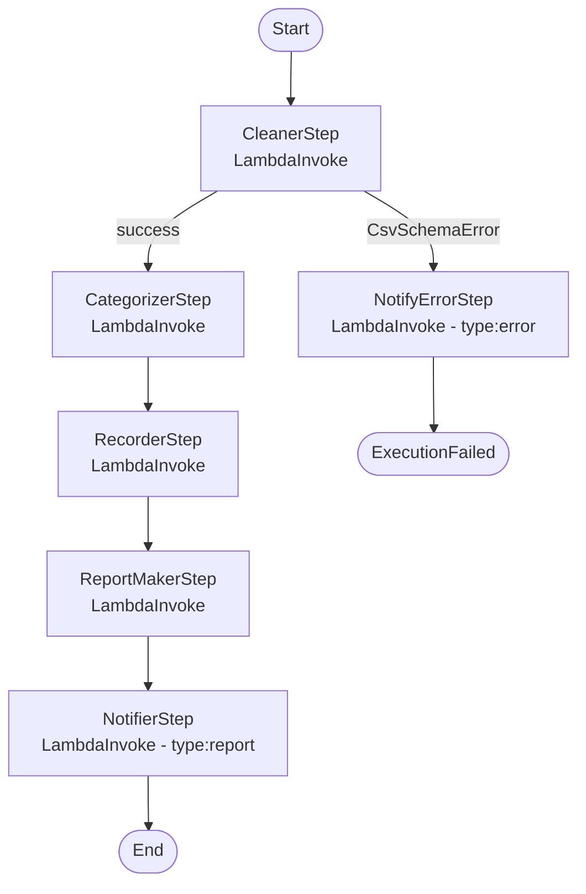

# BG9k-Pipeline State Machine

```mermaid
flowchart TD
    Start([Start]) --> Cleaner[CleanerStep
LambdaInvoke]
    Cleaner -->|success| Categorizer[CategorizerStep
LambdaInvoke]
    Cleaner -->|CsvSchemaError| NotifyError[NotifyErrorStep
LambdaInvoke - type:error]
    Categorizer --> Recorder[RecorderStep
LambdaInvoke]
    Recorder --> ReportMaker[ReportMakerStep
LambdaInvoke]
    ReportMaker --> Notifier[NotifierStep
LambdaInvoke - type:report]
    Notifier --> End([End])
    NotifyError --> Fail([ExecutionFailed])
```
