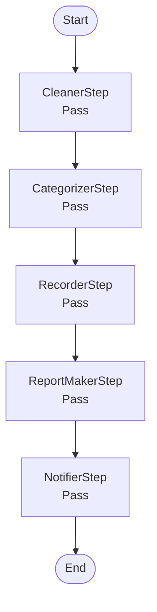

# BG9k-Pipeline State Machine

```mermaid
flowchart TD
    Start([Start]) --> Cleaner[CleanerStep\nPass]
    Cleaner --> Categorizer[CategorizerStep\nPass]
    Categorizer --> Recorder[RecorderStep\nPass]
    Recorder --> ReportMaker[ReportMakerStep\nPass]
    ReportMaker --> Notifier[NotifierStep\nPass]
    Notifier --> End([End])
```

> Pass states are placeholders. Replace with Lambda invocations in T-15.1.
