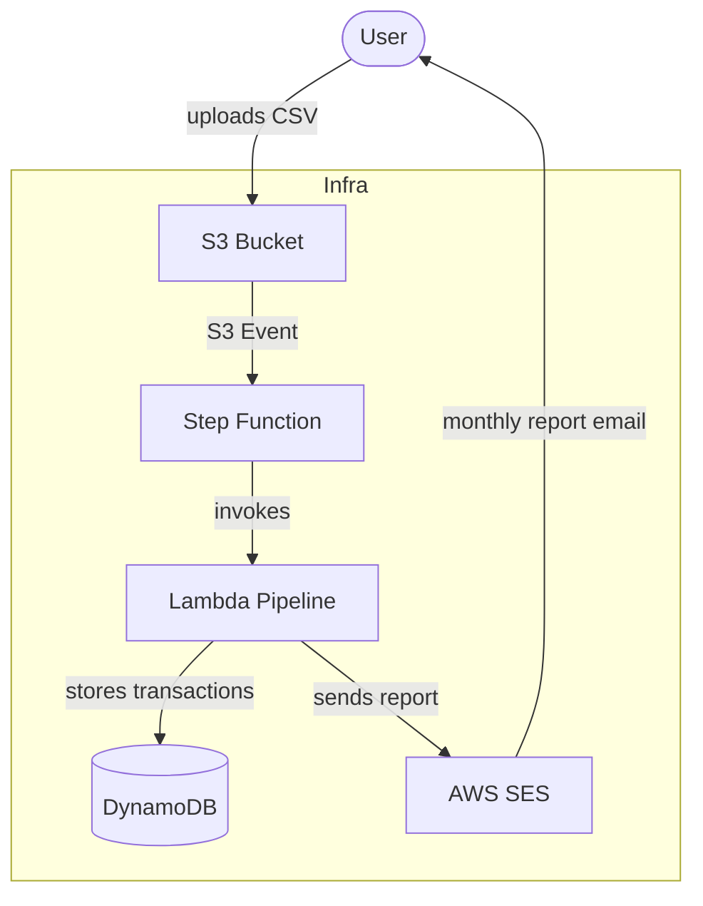
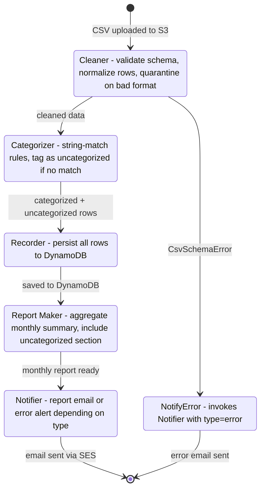

# Project Requirements
- Simple app to upload financial docs in semi-structured manner


Flows:
- User uploads a csv file to an s3 bucket
- Event kicks off step function
- Step function:
    - cleans up data (cleaner)
    - categorize transactions (shopping, utilities, etc.) (categorizer)
        - simple at first (string matching) with room to grow (ML, like scikit-learn?)
    - saves to dynamodb (recorder)
    - produces a report with monthly data. No need to go weekly/daily (report maker)
    - report is sent to email via SES (notifier)
- any lambdas in nodejs
- infra in cdk typescript

## Overall architecture



## Step-function



### S3 layout

```
s3://bucket/
  uploads/                      ← user drops files here
  quarantine/
    bad-format/YYYY-MM/         ← invalid CSV files (expired after 90 days)
    uncategorized/YYYY-MM/      ← unmatched transaction rows as JSON (expired after 90 days)
  processed/YYYY-MM/            ← successfully processed files
```

### Notifier dual-mode

The Notifier Lambda handles both success and error notifications via a `type` field:
- `type: 'report'` — monthly summary email; shows uncategorized warning block if any exist
- `type: 'error'` — operational failure alert with error context (file name, what went wrong)

### ML upgrade path

The `quarantine/uncategorized/` prefix accumulates unmatched transactions — this becomes the training dataset when upgrading to ML categorization. The Categorizer's output contract (`{ categorized, uncategorized }`) stays stable; only the matching logic inside changes (rules → scikit-learn inference). DynamoDB rows with `category = "uncategorized"` can be labeled and exported for supervised training.

### V2 considerations

**More useful reports**
- Budget vs. actual spending per category (set limits in a config file)
- Month-over-month alerts (e.g. "spent X% more than last month on groceries")
- Year-end summary for tax time

**Less manual work**
- Auto-detect bank CSV format so no pre-cleaning needed
- Duplicate transaction detection — safe to re-upload the same file
- S3 lifecycle rule to auto-archive old processed files

**More visibility**
- HTML report attached to the email instead of plain text
- Multiple notification recipients (family members)

**Smarter categorization**
- Rules file stored in S3, editable without redeploying (Categorizer reads at runtime)
- Periodic review flow: pull uncategorized from quarantine, add rules, re-run

**Convenience triggers**
- Scheduled EventBridge rule for month-end report even if no CSV was uploaded
- Alert via SES if no CSV uploaded by the 5th of the month
